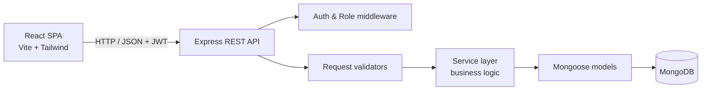

# BizFlow — Business Management System

BizFlow is a full-stack (MERN) business management application for handling
customers, products, orders, staff, inventory-related information, and business
metrics through a role-based system. It ships with a JWT-secured REST API,
role-based access control (Admin / Staff), order-driven stock management, and a
responsive React dashboard built on a small, reusable UI component system.

> **Status:** Application features are implemented and running locally.
> Deployment is planned for the next phase and has **not** been performed yet.

- **Frontend:** React · Vite · Tailwind CSS · React Router · Axios · Lucide React
- **Backend:** Node.js · Express · MongoDB (Mongoose) · JWT · bcryptjs
- **Roles:** Admin · Staff

---

## Table of Contents

- [Overview](#overview)
- [Features](#features)
- [User Roles & Permissions](#user-roles--permissions)
- [Authentication & Authorization](#authentication--authorization)
- [Security](#security)
- [Tech Stack](#tech-stack)
- [Architecture](#architecture)
- [Project Structure](#project-structure)
- [API Documentation](#api-documentation)
- [Environment Variables](#environment-variables)
- [Local Development Setup](#local-development-setup)
- [Testing](#testing)
- [UI/UX & Responsive Support](#uiux--responsive-support)
- [Demo Data & Credentials](#demo-data--credentials)
- [Deployment](#deployment)
- [Screenshots](#screenshots)
- [Future Improvements](#future-improvements)
- [Author](#author)

---

## Overview

BizFlow provides a centralized workspace for day-to-day business operations:

| Module | Purpose |
| --- | --- |
| **Dashboard** | Aggregated business metrics: revenue, counts, order status, inventory, sales trend, recent orders, top products, low-stock alerts |
| **Customers** | Manage customer records with search, filtering, sorting, and pagination |
| **Products** | Manage catalog items, pricing, and stock levels with automatic stock-status handling |
| **Orders** | Create orders from active products, track status through a defined lifecycle, with server-calculated totals and stock deduction/restoration |
| **Staff** | Admin-only management of user accounts, roles, and active/inactive status |

All business data is stored in MongoDB and exposed through a versioned JSON REST
API under `/api`. The React SPA consumes the API with a shared Axios client.

---

## Features

### Dashboard

The dashboard aggregates data from the customer, product, order, and user
collections. Verified metrics returned by `GET /api/dashboard`:

- **Summary** — total customers, total products, total orders, total staff
  (accounts with the `staff` role), and total revenue (sum of **completed**
  order amounts).
- **Order statistics** — counts grouped by status (`pending`, `processing`,
  `completed`, `cancelled`).
- **Inventory statistics** — counts of active, inactive, low-stock, and
  out-of-stock products.
- **Customer statistics** — counts of active and inactive customers.
- **Sales overview** — monthly revenue and order counts for completed orders
  across a rolling 12-month window.
- **Recent orders** — the 5 most recently created orders.
- **Top products** — the 5 best-selling products (by quantity sold) from
  completed orders.
- **Low-stock products** — up to 5 active products at or below the low-stock
  threshold (stock ≤ 5).

### Customer Management

- Create, edit (full update), view by id, delete.
- Search across name, email, phone, and company.
- Filter by status (`active` / `inactive`).
- Sort by `createdAt`, `name`, `email`, `company`, `status` (asc/desc).
- Pagination (default page size 10, max 100).
- Email uniqueness enforced; validation on required fields and formats.

### Product Management

- Create, edit, view by id, delete.
- Search across name, description, and category.
- Filter by category and status (`active` / `inactive` / `out_of_stock`).
- Sort and pagination (same model as Customers).
- Stock management: price ≥ 0 and integer stock ≥ 0. Setting stock to `0`
  automatically moves the product to `out_of_stock`; restoring stock above `0`
  moves an out-of-stock product back to `active`. Inconsistent status/stock
  combinations are rejected.

### Order Management

- Create orders referencing an **active** customer and one or more products.
- Per-item product and quantity selection (no duplicate products in one order).
- **Server-side total calculation** — item prices are snapshotted from the
  product at order time and the total is computed and rounded server-side;
  client-supplied totals are not trusted.
- **Stock validation** — rejects inactive or out-of-stock products and
  quantities exceeding available stock.
- **Atomic stock deduction** on order creation (MongoDB transaction with a
  manual-rollback fallback for non-replica-set environments).
- **Status lifecycle** with enforced transitions:
  `pending → processing → completed`, and `pending`/`processing → cancelled`.
  `completed` and `cancelled` are terminal.
- **Stock restoration** when an order is cancelled (or deleted while still
  `pending`/`processing`).
- Only the order **status** can be updated after creation.
- Delete is blocked for `completed` orders.
- Listing with search (by customer name/email), filter by status and customer,
  sort, and pagination.

### Staff Management (Admin only)

- List, create, edit, view, activate/deactivate, and delete staff accounts.
- Search by name and email; filter by role and status; sort and pagination.
- Accounts created through the API are forced to the `staff` role.
- Guard rails: an admin cannot modify, deactivate, or delete their **own**
  account through the staff API, and **admin accounts cannot be modified or
  deleted** through the staff API.

---

## User Roles & Permissions

Two roles are implemented: **admin** and **staff**.

| Capability | Admin | Staff |
| --- | :---: | :---: |
| Dashboard | ✅ | ✅ |
| Customers (read / create / update / delete) | ✅ | ✅ |
| Products (read / create / update / delete) | ✅ | ✅ |
| Orders (read / create / update status / delete) | ✅ | ✅ |
| Staff management (users) | ✅ | ❌ |

Notes verified from the code:

- Self-registration (`POST /api/auth/register`) always creates a **staff**
  account with `active` status; roles cannot be escalated through registration.
- All `/api/users` routes require the `admin` role.
- Customers, products, orders, and dashboard routes allow both `admin` and
  `staff`.

---

## Authentication & Authorization

- **JWT bearer authentication.** Clients send `Authorization: Bearer <token>`.
- **Login** (`POST /api/auth/login`) issues a token signed with `JWT_SECRET`,
  expiring after `JWT_EXPIRES_IN` (default `1d`).
- **Current user** (`GET /api/auth/me`) returns the authenticated, non-password
  user profile.
- **Logout** (`POST /api/auth/logout`) is stateless — the server confirms the
  request; the client is responsible for removing the stored token.
- **Password hashing** with **bcryptjs** (10 salt rounds); the password field is
  `select: false` and never returned in API responses.
- **Inactive accounts** are rejected at login and on every authenticated request
  (`403 Account is inactive`).
- **Authorization is enforced on both tiers:**
  - *Backend:* `authMiddleware` (token + active user) and `authorizeRoles(...)`
    (RBAC) protect the routes listed above.
  - *Frontend:* `ProtectedRoute` gates authenticated pages and redirects to
    `/login`; `RoleRoute` restricts `/staff` to admins and redirects others to
    `/403`. The sidebar also hides admin-only navigation.
- The frontend stores the token in `localStorage`, attaches it via an Axios
  request interceptor, and clears it automatically on any `401` response.

---

## Security

The application implements several security controls, verified in the source:

- **JWT** signed with a server-side secret; expired/invalid tokens return `401`.
- **bcryptjs** password hashing (passwords are never stored or returned in
  plaintext).
- **Helmet** for secure HTTP response headers.
- **CORS allowlist** via `CORS_ALLOWED_ORIGIN` (comma-separated origins);
  unset falls back to a permissive default for local development only.
- **Input validation** through per-route validators on bodies and query
  parameters.
- **ObjectId validation** (`/^[0-9a-fA-F]{24}$/`) on `:id` and related params
  to prevent malformed/cast-based input.
- **Regex escaping** for search terms to mitigate regular-expression injection.
- **Type-checked query values** (only plain strings/numbers are used in Mongo
  filters), reducing NoSQL/operator-injection risk.
- **Server-authoritative totals and stock** for orders — client price/total
  input is not trusted.
- **Centralized error handling** that maps validation, cast, and duplicate-key
  errors to safe responses without leaking stack traces.
- **Role-based route protection** across the API.
- Secrets and configuration are read from **environment variables** (never
  committed).

> These are defense-in-depth controls for the current scope; the application is
> not represented as being fully or comprehensively secure.

---

## Tech Stack

### Frontend

| Technology | Role |
| --- | --- |
| React | UI library |
| Vite | Build tool and dev server |
| Tailwind CSS | Utility-first styling |
| React Router (`react-router-dom`) | Client-side routing & route guards |
| Axios | HTTP client |
| Lucide React | Icons |

### Backend

| Technology | Role |
| --- | --- |
| Node.js | Runtime (ES modules) |
| Express | HTTP framework |
| MongoDB + Mongoose | Database & ODM |
| jsonwebtoken | JWT signing/verification |
| bcryptjs | Password hashing |
| Helmet | Security headers |
| CORS | Cross-origin policy |
| Morgan | HTTP request logging |
| dotenv | Environment configuration |

### Testing

| Tool | Role |
| --- | --- |
| `node:test` (built-in) | Test runner |
| `mongodb-memory-server` | In-memory MongoDB for integration tests |

---

## Architecture

A single-page React client talks to a REST API over HTTPS. The Express server
validates and authenticates requests, applies business rules in a service layer,
and persists data through Mongoose models in MongoDB.



Key characteristics:

- **Layered backend:** routes → validators → controllers → services → models.
- **Stateless auth:** JWT bearer tokens verified per request.
- **RBAC** applied per route group.
- **Order/stock consistency** handled in the service layer (transactions with a
  rollback fallback).

---

## Project Structure

```text
BizFlow/
├── backend/
│   ├── src/
│   │   ├── config/          # MongoDB connection
│   │   ├── controllers/     # HTTP request handlers
│   │   ├── middleware/      # auth, roles, error & 404 handling
│   │   ├── models/          # Mongoose schemas (User, Customer, Product, Order)
│   │   ├── routes/          # Express routers per module
│   │   ├── scripts/         # demo-data seeder
│   │   ├── services/        # business logic
│   │   ├── utils/           # AppError, token generation
│   │   ├── validators/      # request/query validation
│   │   └── server.js        # app entry / route mounting
│   ├── tests/               # node:test integration tests
│   ├── .env.example
│   └── package.json
│
├── frontend/
│   ├── src/
│   │   ├── components/
│   │   │   ├── layout/      # App shell, Header, Sidebar, nav config
│   │   │   └── ui/          # reusable UI primitives
│   │   ├── context/         # AuthContext
│   │   ├── pages/           # Dashboard, Customers, Products, Orders, Staff, auth/state pages
│   │   ├── routes/          # AppRoutes, ProtectedRoute, RoleRoute
│   │   ├── services/        # Axios client + per-module API services
│   │   ├── App.jsx
│   │   ├── index.css        # Tailwind + design tokens
│   │   └── main.jsx
│   ├── .env.example
│   ├── index.html
│   ├── vite.config.js
│   └── package.json
│
├── .gitignore
└── README.md
```

---

## API Documentation

Base path: `/api`. All responses use a JSON envelope with a `success` flag.

### Health

| Method | Endpoint | Auth | Purpose |
| --- | --- | --- | --- |
| GET | `/api/health` | Public | API health check |

### Authentication

| Method | Endpoint | Auth | Role | Purpose |
| --- | --- | --- | --- | --- |
| POST | `/api/auth/register` | Public | — | Register a new **staff** account |
| POST | `/api/auth/login` | Public | — | Authenticate and receive a JWT |
| GET | `/api/auth/me` | Bearer | Any active user | Get current user profile |
| POST | `/api/auth/logout` | — | — | Stateless logout hint (client removes token) |

### Customers (Admin, Staff)

| Method | Endpoint | Auth | Purpose |
| --- | --- | --- | --- |
| GET | `/api/customers` | Bearer | List (search, filter, sort, pagination) |
| POST | `/api/customers` | Bearer | Create |
| GET | `/api/customers/:id` | Bearer | Get by id |
| PUT | `/api/customers/:id` | Bearer | Update |
| DELETE | `/api/customers/:id` | Bearer | Delete |

### Products (Admin, Staff)

| Method | Endpoint | Auth | Purpose |
| --- | --- | --- | --- |
| GET | `/api/products` | Bearer | List (search, filter, sort, pagination) |
| POST | `/api/products` | Bearer | Create |
| GET | `/api/products/:id` | Bearer | Get by id |
| PUT | `/api/products/:id` | Bearer | Update |
| DELETE | `/api/products/:id` | Bearer | Delete |

### Orders (Admin, Staff)

| Method | Endpoint | Auth | Purpose |
| --- | --- | --- | --- |
| GET | `/api/orders` | Bearer | List (search, filter, sort, pagination) |
| POST | `/api/orders` | Bearer | Create (validates stock, calculates total, deducts stock) |
| GET | `/api/orders/:id` | Bearer | Get by id |
| PUT | `/api/orders/:id` | Bearer | Update **status** only |
| DELETE | `/api/orders/:id` | Bearer | Delete (restores stock unless already cancelled) |

### Users / Staff (Admin only)

| Method | Endpoint | Auth | Purpose |
| --- | --- | --- | --- |
| GET | `/api/users` | Bearer | List staff (search, filter, sort, pagination) |
| POST | `/api/users` | Bearer | Create staff account |
| GET | `/api/users/:id` | Bearer | Get by id |
| PATCH / PUT | `/api/users/:id` | Bearer | Update staff account |
| PATCH | `/api/users/:id/status` | Bearer | Activate / deactivate |
| DELETE | `/api/users/:id` | Bearer | Delete staff account |

### Dashboard (Admin, Staff)

| Method | Endpoint | Auth | Purpose |
| --- | --- | --- | --- |
| GET | `/api/dashboard` | Bearer | Aggregated metrics (summary, stats, sales, recent/top/low-stock) |

---

## Environment Variables

Real `.env` files must **never** be committed. Copy the example files and fill
in values for your environment.

### Backend (`backend/.env`, from `backend/.env.example`)

```env
PORT=5000
MONGODB_URI=
JWT_SECRET=
JWT_EXPIRES_IN=1d
CORS_ALLOWED_ORIGIN=
```

| Variable | Used for |
| --- | --- |
| `PORT` | HTTP port the API listens on (default `5000`) |
| `MONGODB_URI` | MongoDB connection string (Atlas or local) |
| `JWT_SECRET` | Secret used to sign/verify JWTs (must be a strong random value) |
| `JWT_EXPIRES_IN` | Token lifetime (e.g. `1d`, `12h`) |
| `CORS_ALLOWED_ORIGIN` | Comma-separated allowed frontend origins; leave unset for local dev |

### Frontend (`frontend/.env.local`, from `frontend/.env.example`)

```env
VITE_API_BASE_URL=http://localhost:5000/api
```

| Variable | Used for |
| --- | --- |
| `VITE_API_BASE_URL` | Base URL of the backend API. Only `VITE_*` variables are exposed to the browser — never place secrets here. |

---

## Local Development Setup

### Prerequisites

- **Node.js 18+** — the backend uses ES modules, `node --watch`, and the
  built-in `node --test` runner.
- **MongoDB** — a MongoDB Atlas cluster or a local MongoDB instance
  (a replica set is required for order transactions; the code falls back to a
  manual rollback path otherwise).
- **Git**.

> No `engines` version is pinned in the project's `package.json` files.

### Clone

```bash
git clone <repository-url>
cd BizFlow-Business-Management-System
```

> Replace `<repository-url>` with your clone URL. The configured remote is the
> project's GitHub repository (see [Author](#author)).

### Backend

```bash
cd backend
npm install
# create backend/.env from backend/.env.example and set your values
npm run dev        # start API with auto-reload (or: npm start)
```

Optionally seed demo data (see [Demo Data & Credentials](#demo-data--credentials)):

```bash
npm run seed
```

### Frontend

```bash
cd frontend
npm install
# create frontend/.env.local from frontend/.env.example if you change the API URL
npm run dev        # start Vite dev server (or: npm run build && npm run preview)
```

The Vite dev server prints its local URL. By default the frontend expects the
API at `http://localhost:5000/api`.

### Environment setup

Create `backend/.env` and `frontend/.env.local` from their respective
`.env.example` files, then provide the values described in
[Environment Variables](#environment-variables).

---

## Testing

- **Framework:** Node.js built-in test runner (`node:test`) with
  `mongodb-memory-server` providing an in-memory MongoDB (a replica set) for
  integration-style tests.
- **Command (from `backend/`):**

  ```bash
  npm test
  ```

- **Coverage areas** (test files under `backend/tests/`):
  authentication, users/staff, customers, products, orders, and dashboard.

Tests set `NODE_ENV=test`, so the app exports the Express server without
starting a listener, and DB-dependent suites skip if no in-memory MongoDB is
available.

---

## UI/UX & Responsive Support

The frontend uses a restrained, professional design system built on Tailwind CSS
with neutral (zinc) surfaces; color accents (emerald/amber/red) are reserved for
status indication. Blue/indigo/purple-heavy styling and decorative gradients are
intentionally not used.

Verified UI characteristics:

- **Responsive layout** — fixed sidebar rail on desktop and a slide-in drawer
  with overlay on mobile/tablet (toggled from the header, closes on route change
  and `Escape`).
- **Responsive tables** with a shared component system: `Card`, `Badge`,
  `Button`, `IconButton`, `Field`/`Input`/`Select`/`Textarea`, `Modal`,
  `ConfirmModal`, `Toast`, `Alert`.
- **List ergonomics** — `SearchInput`, `FilterSelect`, `SortHeader`, and
  `Pagination` support the search/filter/sort/paginate behavior of the modules.
- **Loading, empty, and error states** — `Skeleton`/`LoadingState`,
  `EmptyState`, and `ErrorState` components.
- **Client-side form validation** on create/edit flows, with server validation as
  the source of truth.
- **Feedback via toasts** for create/update/delete actions.

The app adapts across **mobile, tablet, and desktop** breakpoints. No specific
viewport QA matrix is claimed beyond the implemented responsive behavior.

---

## Demo Data & Credentials

A seed script is provided for local development and demonstration:

```bash
cd backend
npm run seed
```

It is **add-only and idempotent** (existing records are matched on unique keys
and skipped), and it creates demo customers, products, orders, and staff
accounts, including one **admin** account. The demo password is defined in
`backend/src/scripts/seedDemoData.js` and applies **only** to the seeded demo
accounts:

```text
Demo password (local seed only): <see backend/src/scripts/seedDemoData.js>
```

> These are throwaway local/demo credentials from the repository's seed script,
> **not** production secrets. Change them, and the `JWT_SECRET`, in any real
> deployment.

---

## Deployment

> **Deployment configuration is planned for the next phase. BizFlow is not
> currently deployed.**

The **intended** (planned) target architecture is:

| Component | Planned target |
| --- | --- |
| Frontend | Vercel |
| Backend API | Vercel |
| Database | MongoDB Atlas |

```text
Frontend:     <coming soon>
Backend API:  <coming soon>
```

No live URLs exist yet. When deployment is configured, set the production
environment variables (including `MONGODB_URI`, a strong `JWT_SECRET`, the
frontend's `VITE_API_BASE_URL`, and `CORS_ALLOWED_ORIGIN` pointing at the
deployed frontend origin).

---

## Screenshots

Screenshots will be added after the production deployment phase.

- Dashboard
- Customers
- Products
- Orders
- Staff Management
- Login

---

## Future Improvements

The following are **not** currently implemented and are reasonable next steps:

- Payments / invoicing
- File and image uploads (e.g. product images)
- Real-time updates (WebSockets)
- Refresh tokens / token rotation (logout is currently stateless)
- Docker containerization
- CI/CD pipelines
- Advanced reporting and analytics
- Email notifications

---

## Author

Built by **Sabeer Alam** — Full Stack Developer.

- GitHub: [https://github.com/sabeerdeveloper555](https://github.com/sabeerdeveloper555)
